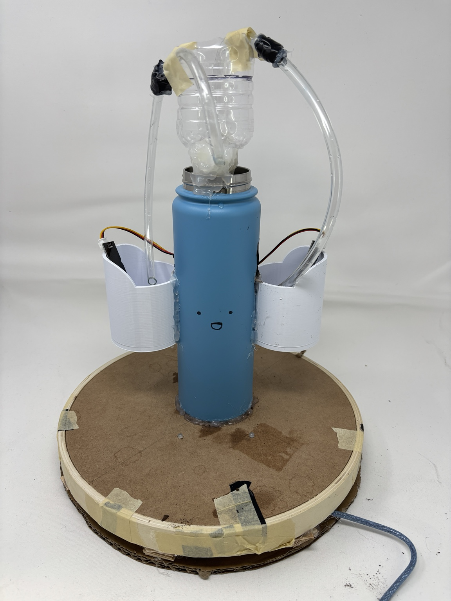
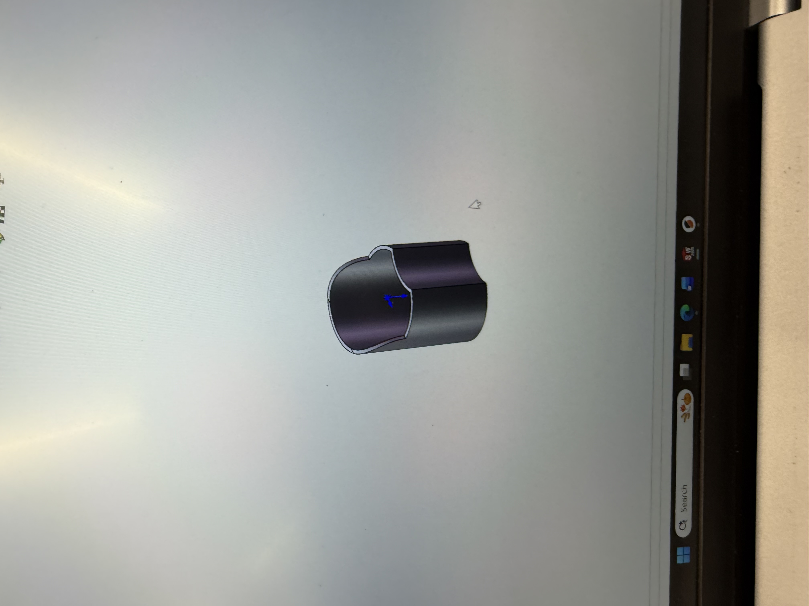

# Self-Watering-Plant-System
Arduino-based automatic plant watering system using soil moisture sensors and water valves.
# SAMI — Self-Watering Plant System

SAMI (Semi-Automated Micro Irrigator) is an Arduino-based
automatic plant watering system designed to monitor soil
moisture and provide water when plants become too dry.

## Features

- Capacitive soil moisture sensing
- Automatic watering
- Two independently controlled water valves
- RGB LED status indicators
- Arduino UNO R3 control

## Hardware

- Arduino UNO R3
- 2x capacitive soil moisture sensors
- 2x water valves
- 2x 2N2222 transistors
- RGB LEDs
- Resistors
- Water reservoir
- Tubing

## How It Works

The moisture sensors continuously measure the moisture
level of the soil. When the moisture level falls below
the programmed threshold, the Arduino activates the
corresponding water valve.

## Design & Engineering

The Arduino reads analog signals from the capacitive soil
moisture sensors. When the measured moisture level falls
below a programmed threshold, the Arduino activates a
2N2222 transistor, which controls the corresponding water
valve.

RGB LEDs provide visual feedback about the moisture state
of each plant.

## Future Improvements

- Add wireless monitoring
- Add a water-level sensor
- Create a mobile app
- Improve moisture calibration
